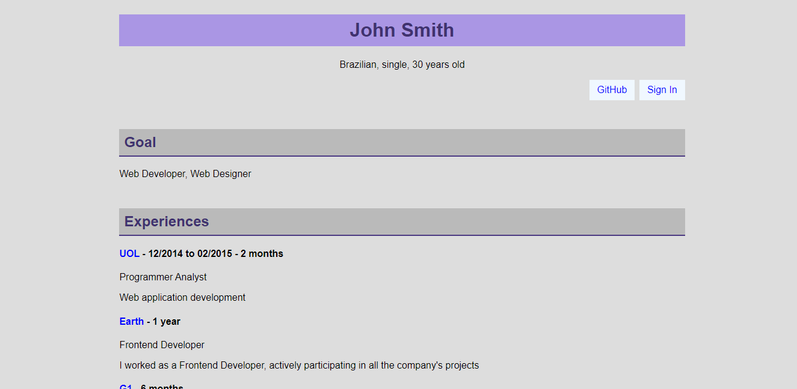

<h1>HELLO THERE!!! WELCOME TO MY -PRACTICE- REPOSITORY!!!</h1>
 
<h3>This repository shows all projects that I develop during my Web Frontend Fundamentals by Udemy till the moment. So I want show its the best way as possible.</h3>
 
<h4>The course surround frontend skills like HTML5, CSS3 and JS so the first projects shows just HTML5 structure and CSS3 styling.</h4>
 
<h4>Here we go.</h4>
 
<h5>The first project that I developed was a simple curriculum.</h5>

